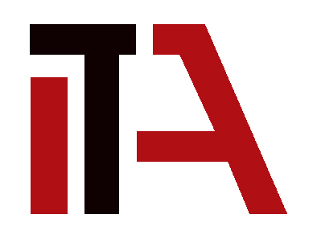

<a name="readme-top"></a>


<div align="center">

  
  <br/>

  <h3><b>Full Stack Developers</b></h3>

</div>

# 📗 Table of Contents

- [📖 About the Project](#about-project)
  - [🛠 Built With](#built-with)
    - [Tech Stack](#tech-stack)
    - [Key Features](#key-features)
    - [Video Demo](#video-demo)
- [💻 Getting Started](#getting-started)
  - [Setup](#setup)
  - [Prerequisites](#prerequisites)
  - [Install](#install)
  - [Usage](#usage)
- [👥 Authors](#authors)
- [🔭 Future Features](#future-features)
- [🤝 Contributing](#contributing)
- [⭐️ Show your support](#support)
- [🙏 Acknowledgements](#acknowledgements)
- [📝 License](#license)


# 📖 Ruby Capstorne Project <a name="about-project"></a>

> In this project, we created a console app that will help us to keep a record of different types of things you own: books, music albums, and games. Everything will be based on the UML class diagram presented below. The data will be stored in JSON files but we also prepared a database with tables structure analogical to your program's class structure.

  </br>
  <div align="center"> </div>
  </br>

## 🛠Built With <a name="built-with"></a>

### Tech Stack <a name="tech-stack"></a>

> This project uses the following stack :


- Ruby
- OOP Ruby
- PostgreSQL
- Rubocop linter

<p align="right">(<a href="#readme-top">back to top</a>)</p>


## Video Demo <a name="video-demo"></a>

This video is about the description of the project. You can find by clicking the [link](https://drive.google.com/file/d/1FLxM75sPfwj-MA0j4juJInu4ronkL1Hh/view?usp=sharing)

<p align="right">(<a href="#readme-top">back to top</a>)</p>

### Key Features <a name="key-features"></a>

- **Create Item class in a separate .rb file**
- **Add All Item class properties visible in the diagram defined and set up in the constructor method**
- **Implement methods:can_be_archived?() in the Item class**
- **Four Principle of OOP**

<p align="right">(<a href="#readme-top">back to top</a>)</p>


## 💻 Getting Started <a name="getting-started"></a>


To get a local copy up and running, follow these steps.

### Prerequisites

In order to run this project you need:

You should have Ruby install on your local machine

### Setup

Clone this repository to your desired folder:

Example commands:

```sh
  cd my-folder
  git clone https://github.com/iqbal-elham/Ruby-capstone.git
```

### Install

To install ruby go to : [Install Ruby](https://rubyinstaller.org/) and select your operating system.


### Usage

To run the project, open your project in your terminal  and type ruby test.rb .

Example command:

```sh
  ruby test.rb
```

<p align="right">(<a href="#readme-top">back to top</a>)</p>

## 👥 Author <a name="authors"></a>

👤 **Iqbal Elham**

- GitHub: [@iqbal-elham](https://github.com/Iqbal-Elham)
- linkedIn: [@iqbal-elham](https://www.linkedin.com/in/iqbal-elham)

👤 **Timothy Njoroge**

- GitHub: [@simplegoose](https://github.com/simplegoose)
- linkedIn: [@Timothy Njoroge](https://www.linkedin.com/in/timothy-njoroge-mwangi)

👤 **Abraham Christopher**

- GitHub: [@cabraham1](https://github.com/cabraham1)
- linkedIn: [@Abraham Christopher](https://www.linkedin.com/in/abrahamchristopher/)


<p align="right">(<a href="#readme-top">back to top</a>)</p>


## 🔭 Future Features <a name="future-features"></a>


- **Create a Book class in a separate .rb file Create a Label class with an association to the Item class (in a separate .rb file)**
- **Remove a selected book**
- **Add genre to selected book**

<p align="right">(<a href="#readme-top">back to top</a>)</p>


## 🤝 Contributing <a name="contributing"></a>

Contributions, issues, and feature requests are welcome!

Feel free to check the [issues page](https://github.com/iqbal-elham/Ruby-capstone/issues).

<p align="right">(<a href="#readme-top">back to top</a>)</p>


## ⭐️ Show your support <a name="support"></a>

Give a ⭐️ if you like this project!

<p align="right">(<a href="#readme-top">back to top</a>)</p>


## 🙏 Acknowledgments <a name="acknowledgements"></a>

> I would like to thank the Microverse team.

<p align="right">(<a href="#readme-top">back to top</a>)</p>


## 📝 License <a name="license"></a>

This project is [MIT](./MIT.md) licensed.

<p align="right">(<a href="#readme-top">back to top</a>)</p>
